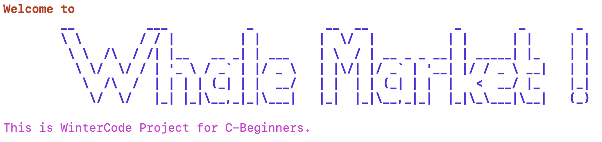
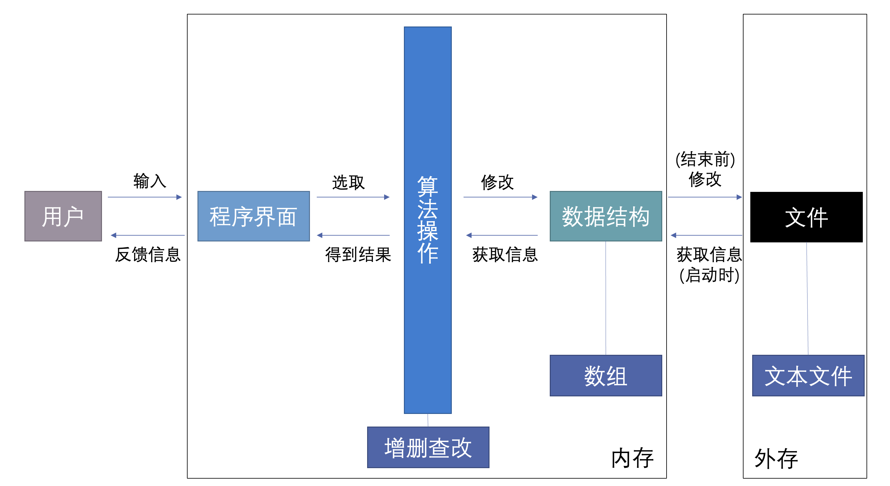

# 😄 欢迎来到 WinterCode

**Author： CJC from NJU**

**Email： 201220014@smail.nju.edu.cn**

## 概况与环境&#x20;

大部分的应用型程序其实从大框架上来讲就是一个信息管理系统，比如淘宝，微信，B站，微博等等。信息管理系统也是大部分开发者学习阶段上手的第一个项目。Whale Market是一个基于命令行的简易交易平台。

参考版本：[https://github.com/201220014/WhaleMarket](https://github.com/201220014/WhaleMarket)

设计参考南京大学程设基础实验课程项目一所提出的需求。

本教程会手把手详细叙述开发的全过程，并且会尽量在代码中覆盖程序设计基础课程的大部分内容，特别是老师轻描淡写带过的一些细节内容，以保证本项目的教学性。

代码是开源的，您可以搭建自己的本地开发环境，需要的环境很简单：`editor + linux + gcc + make`。其中，编辑器以及Linux发行版可以根据自己的喜好选择。


对于刚接触Linux的同学，Ubuntu桌面版Linux和VSCode编辑器会比较友好一些。

Ubuntu： [https://ubuntu.com/](https://ubuntu.com)

VSCode： [https://code.visualstudio.com/](https://code.visualstudio.com)

Linux文件管理基本命令： [https://www.runoob.com/linux/linux-file-content-manage.html](https://www.runoob.com/linux/linux-file-content-manage.html)



建议没有环境的同学尝试自己上网搜索教程配置，锻炼一下配环境的能力。

参考教程：[https://box.nju.edu.cn/f/bf8b3075561c4a168b25/](https://box.nju.edu.cn/f/bf8b3075561c4a168b25/)

上述环境配置教程来源于2021春南京大学程设基础实验课程project2的一位助教哥哥。


## 需求汇总

再这个项目中，我们需要实现如下的基本需求：

* 用户功能：
  * 登陆、注册、注销
* 买家功能
  * 查看、搜索商品
  * 购买商品
* 卖家功能
  * 商品的发布、下架
  * 查看已发布商品
  * 修改商品信息
* 查看历史订单
* 个人信息查看、修改
* 管理员功能
  * 登陆、注销
  * 查看、搜索、下架商品
  * 查看所有订单
  * 查看、删除用户
* 系统功能
  * 程序结束后再次打开程序，原本的数据不能丢失

> 更加具体的需求以及示例详见：[https://github.com/201220014/WhaleMarket](https://github.com/201220014/WhaleMarket)
>
> **github无法正常显示图片的可以看教程中“详细需求补充”这一页。**
>
> 也可以下载参考版的源码在环境中构建项目并运行进行预览。


注意：不同的主体增删查改的权限是不一样的。


## 设计思路

针对涉及到的各种主体设计不同的数据类型，然后选择一种合适的数据结构在内存中存储数据，使用文件读写的方式来与外存交互，以保证程序结束后再次运行数据不丢失。

用户通过特定的接口或者界面与程序交互，接口/界面负责调用程序中已经设计好的算法来操作数据结构，同时获取结果，接口/界面再将算法的结果以某种形式反馈给用户。

具体可以用下图表示：

## 模块划分

主要分成如下模块：

| 名称        | 作用                      |
| --------- | ----------------------- |
| tools     | 一些辅助工具（样式设计、日期、ID生成等内容） |
| menu      | 菜单模块，接口模块的辅助模块          |
| good      | 商品模块，包括涉及商品的算法和数据结构     |
| user      | 用户模块，包括涉及用户的算法和数据结构     |
| order     | 订单模块，包括涉及订单的算法和数据结构     |
| interface | 接口/界面模块，实现用户和数据结构的交互    |
| main.c    | 程序入口                    |


到此，你应该对本项目的基本框架有所了解了，下面，让我们来看一下这个项目的构建过程吧:smile:！


