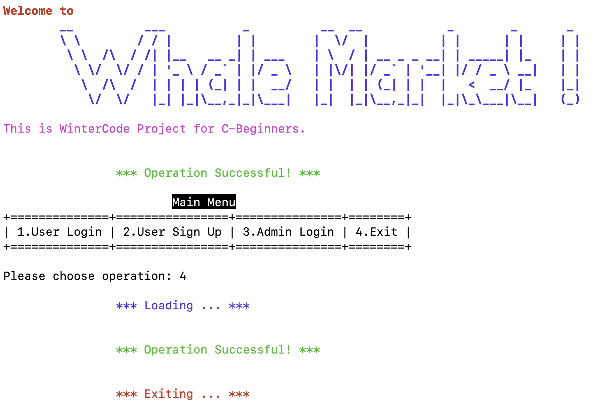

# 📃 封装设计各界面的菜单

## 菜单到底在做什么

简单来说，一个菜单做了三件事情：

* 告知用户有哪些选项
* 请用户作出一个选择
* 将用户的选择传给交互界面处理

我们用一个整数值表示用户的选择，菜单的基本效果如下：



## 一个稚嫩的实现方式

这个效果的实现其实还是蛮简单的：

```c
// menu.c
#include <stdio.h>

int mainMenu() {
    printf("\
\t\t\tMain Menu\n\
+==============+================+===============+========+\n\
| 1.User Login | 2.User Sign Up | 3.Admin Login | 4.Exit |\n\
+==============+================+===============+========+\n");
    printf("Please choose operation:");
    int res;
    scanf("%d", &res);
    return res;
}
```

上面就是主菜单的一个简单实现了，当我们写交互界面的时候只需要调用这个函数，就可以知道用户选择了第几个选项，然后选择相应的处理函数（这个处理函数需要自己来实现）来处理这个选择就可以。

但此时我们发现了两个问题：

*   用户的非法输入

    > 如果用户不听话，输入了比1小或者比4大的数字怎么办？
    >
    > 如果用户更狂野一点，输入了`3.1415926535`（小数）怎么办？
    >
    > 如果用户疯了，输入了“F\* You!"（字符串）怎么办？
*   有很多类似的菜单

    > 每个菜单函数的内容都差不多，只不过是提示信息和选项个数变了。
    >
    > 我们需要每个菜单都写一个几乎重复的函数吗？

## 优化：健体+瘦身

### “健体”优化：处理用户的非法输入，提升鲁棒性


### “瘦身”优化：泛化编程，一个函数写完所有的菜单

