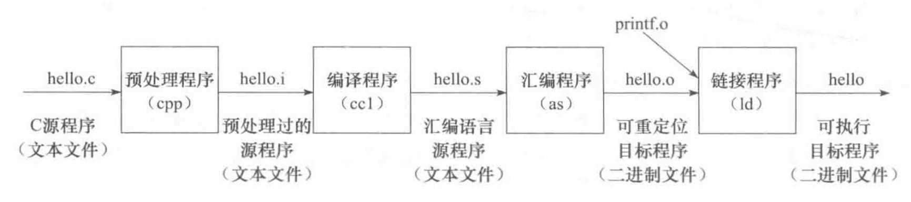

# 👷 项目是怎样构建的

## C程序是怎样生成的

```c
// hello.c
#include <stdio.h>

int main() {
    printf("Hello, WinterCode!\n");
    return 0;
}
```

C程序，或者说C家族程序从源代码到可执行程序的过程可以用下图表示：



经过了编译预处理、编译、汇编、链接四个阶段。

在`linux`下使用`gcc`构建c程序的过程（以`hello.c`为例）可以用如下命令表示：

```bash
gcc -c hello.c -o hello.o # 编译
gcc hello.o -o hello # 链接
```

当然，如果是单模块的话也可以合并为一个命令：

```bash
gcc hello.c -o hello
```

之后，我们只需要运行二进制文件hello就可以运行我们的程序了。

```bash
./hello
Hello, WinterCode!
```

## C项目是怎样搭建的

我们以WhaleMarket的`Makefile`为例来看一下C工程是如何搭建的。

```makefile
.PHONY: clean # 伪目标

# 自定义环境变量
CC = gcc # 指定编译器

CFLAGS = -I include # 指定头文件目录
CFILES = $(shell find src -name "*.c") # 搜索所有的源文件
OBJS = $(CFILES:.c=.o) # 所有的目标文件
TARGET = main # 最终生成目标
DATA = src/data/*.txt # 搜索所有的数据文件

RM = -rm -f # 删除方式

all: $(TARGET)
	git commit -a -m "> make"

# 项目构建方式
$(TARGET): $(OBJS)
	$(CC) -o $(TARGET) $(OBJS)

%o : %c
	$(CC) -c $(CFLAGS) $< -o $@

clean:
	$(RM) $(TARGET) $(OBJS) $(DATA)
	git commit -a -m "> make clean"
```

其中我们关注如下内容：

```makefile
# 项目构建方式
$(TARGET): $(OBJS)
	$(CC) -o $(TARGET) $(OBJS) # 将所有的目标文件链接形成最终的可执行文件

%o : %c
	$(CC) -c $(CFLAGS) $< -o $@ # 编译所有的源文件
```

现阶段你或许不需要详细了解Makefile的全部含义，当然，如果你感兴趣，可以查看这个链接： [https://blog.csdn.net/weixin\_38391755/article/details/80380786](https://blog.csdn.net/weixin\_38391755/article/details/80380786)


值得注意一下的是，在这个Makefile中，我们约定了所有的头文件放在`include`文件夹里，所有的源文件放在`src`文件夹里，所有项目构建过程中生成的的目标文件放在对应源文件的统一目录下。


这个约定是通过下面三条定义来实现的：

```makefile
CFLAGS = -I include # 指定头文件目录
CFILES = $(shell find src -name "*.c") # 搜索所有的源文件
OBJS = $(CFILES:.c=.o) # 所有的目标文件
```

## 什么是模块

一个模块通常是由**一个头文件和一个或者多个源文件**构成的。

比如说下面的hello.h和hello.c就构成了一个模块。

```c
// hello.h
void hello();
```

```c
// hello.c
#include "hello.h" // 头文件的文件路径（相对于include文件夹的路径）

#include <stdio.h>

void hello() {
    printf("Hello, WinterCode!\n");
}
```

我们可以在其他模块里面通过包含该模块的头文件来使用该模块中的内容。

```c
// main.c
#include "hello.h"

int main() {
    hello();
    return 0;
}
```

那这个简单的双模块项目的编译执行过程可以用如下命令表示：

```c
gcc -c hello.c -o hello.o
gcc -c main.c -o main.o
gcc hello.o main.o -o main
./main
Hello, WinterCode!
```

结合上述简单双模块程序的构建，或许你现在可以看懂一些些我们的Makefile了。


至此，你对这个项目的构建过程应该已经大致掌握了，下面我们可以运行一下框架代码，测试自己的环境。


