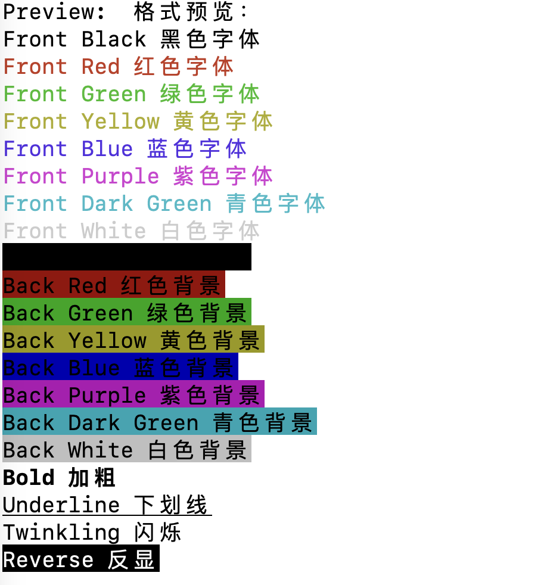

# 🎨 颜色与响铃是怎样做到的

## ANSI控制码

如果你感兴趣linux终端中的颜色式样是怎么做出来的，我在这里简单讲解一下`color`模块的内容。

终端样式设计的基本原理是ANSI（= American National Standard Institution）控制码，详细内容可以参照下面的链接： [https://en.wikipedia.org/wiki/ANSI\_escape\_code](https://en.wikipedia.org/wiki/ANSI\_escape\_code)

我不展开讲它的原理，我们来看一下tools模块中color模块里面color.h和color.c里面到底封装了怎样的内容：

```c
// color.h

#ifndef _COLOR_H_
#define _COLOR_H_

// Only Effective for Linux / Unix

/** Reset all the Attributes */
extern const char* RESET;

/** Set Font Color
 * Format: "\033[BackColor;FrontColormString\033[0m"
*/
extern const char* FRONT_BLACK;
extern const char* FRONT_RED;
extern const char* FRONT_GREEN;
extern const char* FRONT_YELLOW;
extern const char* FRONT_BLUE;
extern const char* FRONT_PURPLR;
extern const char* FRONT_DARKGREEN;
extern const char* FRONT_WHITE;

extern const char* BACK_BLACK;
extern const char* BACK_RED;
extern const char* BACK_GREEN;
extern const char* BACK_YELLOW;
extern const char* BACK_BLUE;
extern const char* BACK_PURPLR;
extern const char* BACK_DARKGREEN;
extern const char* BACK_WHITE;

/** Set Font Effect */
extern const char* BOLD;
extern const char* UNDERLINE;
extern const char* TWINKLING;
extern const char* REVERSE;
extern const char* HIDE;

#endif
```


这里涉及到了`extern`关键字声明外部变量的知识点，如果有不清晰的地方，请先寻找相关教程复习一下这个知识点。

参考教程： [https://www.runoob.com/cprogramming/c-storage-classes.html](https://www.runoob.com/cprogramming/c-storage-classes.html)

本教程后续将默认读者知道`extern`关键字的功能与使用方法。



这里还涉及到了C头文件引用的相关知识点，特别是自定义头文件的引用，这个知识点可能并没有在程序设计基础课程中被展开讲解，希望不清楚的读者先寻找相关教程学习一下这部分知识。

参考教程： [https://www.runoob.com/cprogramming/c-header-files.html](https://www.runoob.com/cprogramming/c-header-files.html)

本教程后续将默认读者知道自定义C头文件的书写格式和引用规则。


正如我们前面所说，头文件里面应该放声明，定义放在源文件里面。

```c
// color.c
#include "tools/color.h"

const char* RESET           = "\033[0m";
const char* FRONT_BLACK     = "\033[30m";
const char* FRONT_RED       = "\033[31m";
const char* FRONT_GREEN     = "\033[32m";
const char* FRONT_YELLOW    = "\033[33m";
const char* FRONT_BLUE      = "\033[34m";
const char* FRONT_PURPLR    = "\033[35m";
const char* FRONT_DARKGREEN = "\033[36m";
const char* FRONT_WHITE     = "\033[37m";

const char* BACK_BLACK      = "\033[40m";
const char* BACK_RED        = "\033[41m";
const char* BACK_GREEN      = "\033[42m";
const char* BACK_YELLOW     = "\033[43m";
const char* BACK_BLUE       = "\033[44m";
const char* BACK_PURPLR     = "\033[45m";
const char* BACK_DARKGREEN  = "\033[46m";
const char* BACK_WHITE      = "\033[47m";

const char* BOLD            = "\033[1m";
const char* UNDERLINE       = "\033[4m";
const char* TWINKLING       = "\033[5m";
const char* REVERSE         = "\033[7m";
const char* HIDE            = "\033[8m";
```

在源文件里面我们可以看到，ANSI控制码其实就是一个特殊的字符串，向终端中打印这样的字符串可以改变终端的样式，我们将这些特殊的字符串封装好，以便其他模块使用。

在终端中的样式预览如下：



> 闪烁样式是动态的。


注意，在使用样式后如果不打印`RESET`，那么之后所有的内容都会沿用这个样式。


## 演示一下基本的使用方式

要求：打印闪烁的`Hello, WinterCode!`。

> 可以暂时把main.c中的其他内容注释掉来写这个演示程序。

编写源代码：

```c
// main.c
#include "color.h" // 包含头文件color.h
#include <stdio.h>

const char* hello = "Hello, WinterCode!"

int main() {
    printf("%s%s%s\n", TWINKLING, hello, RESET);
    return 0;
}
```

构建执行：

```bash
make
# 一些过程信息
./main
# 闪烁的 Hello, WinterCode!
```

## '\a'转意字符

`\a`这个字符的含义就是`alarm`，向终端中打印该字符会出发系统的默认响铃。

比如说：

```bash
echo "\a"
# 你会听到系统的默认响铃
```


到此，你应该明白了程序中的颜色和响铃是如何做到的了吧？希望在你的程序中能够多运用这些使你的程序丰富多彩，颜值赛高。


