# 🤱 详细需求补充


下面的具体需求仅供参考，真正自己动手写是很自由的，不需要局限于下面所说的内容。


> 注：以下功能描述参考南京大学2021年春程序设计基础实验课程project1的需求描述。

## 管理员功能简介

.png>)

.png>)

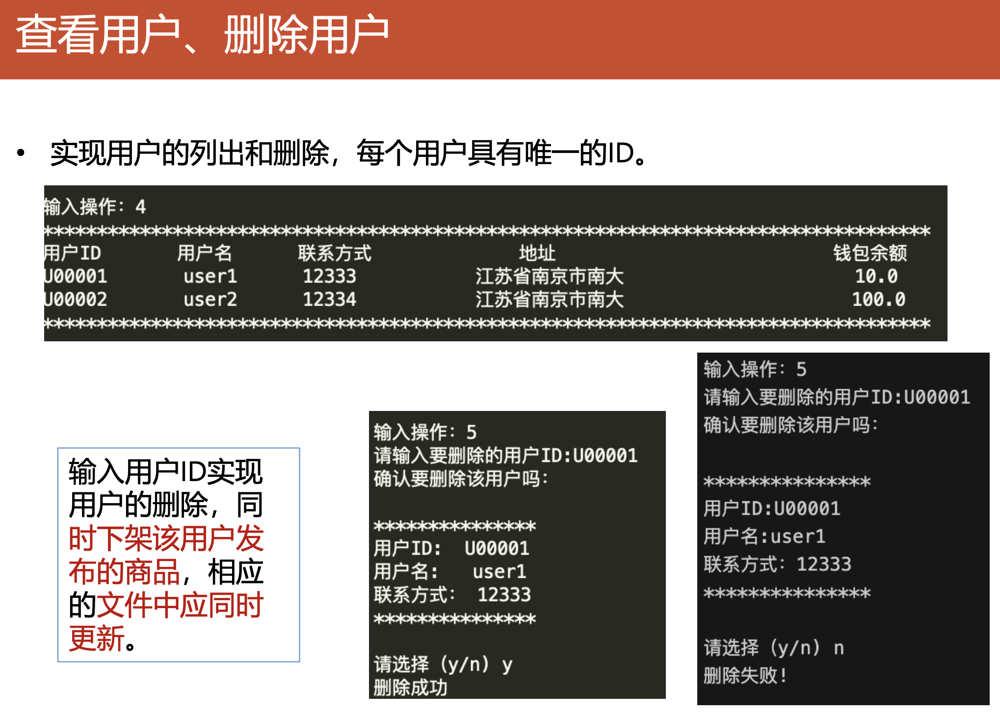

## 用户功能简介

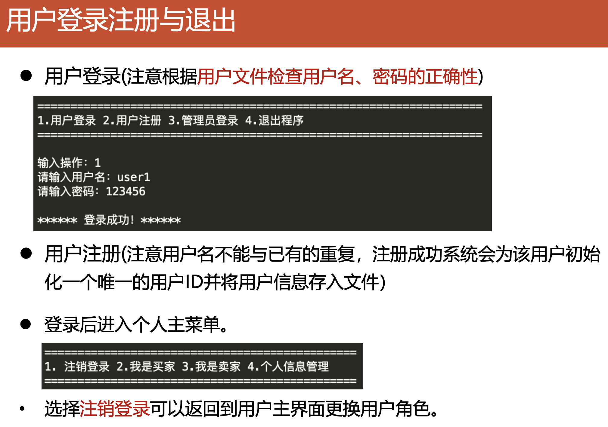

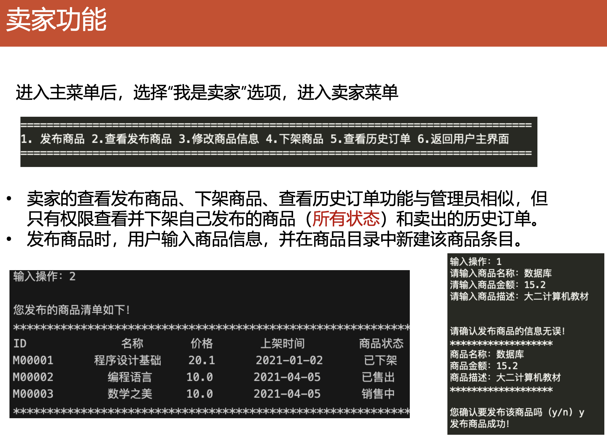

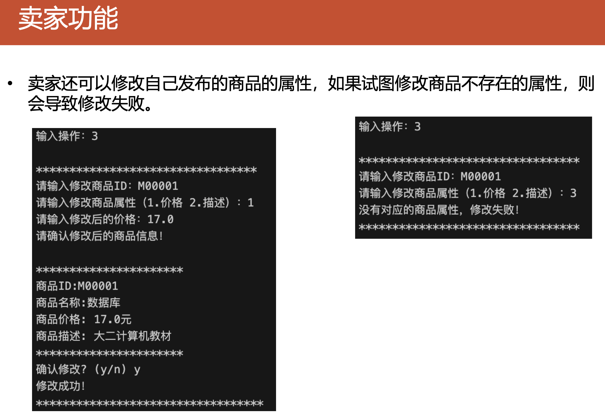

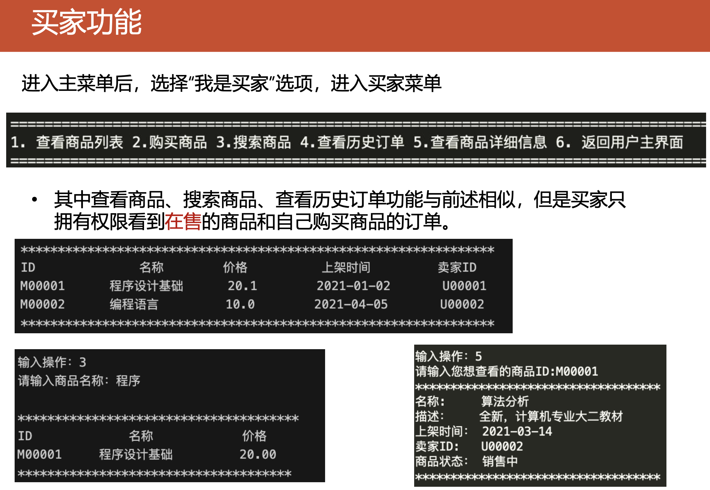

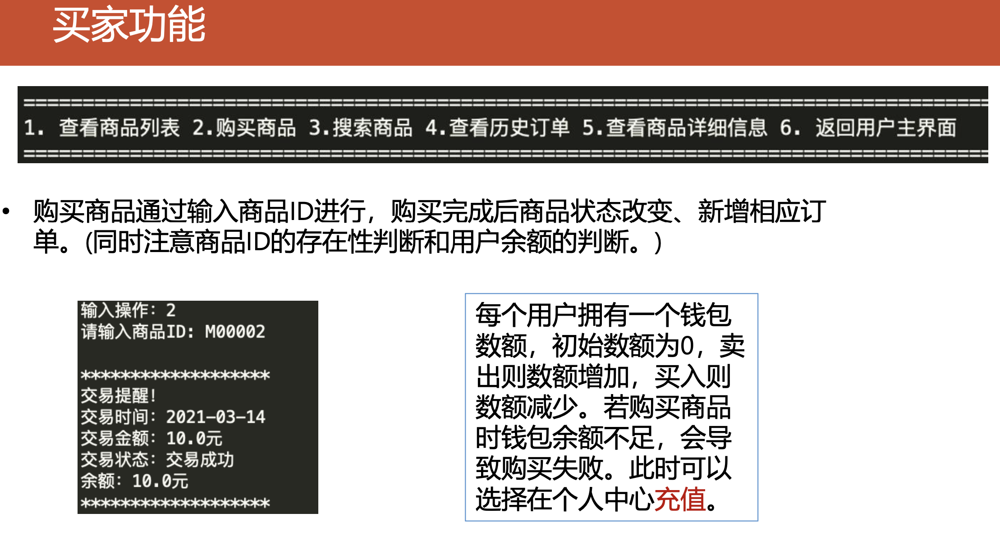

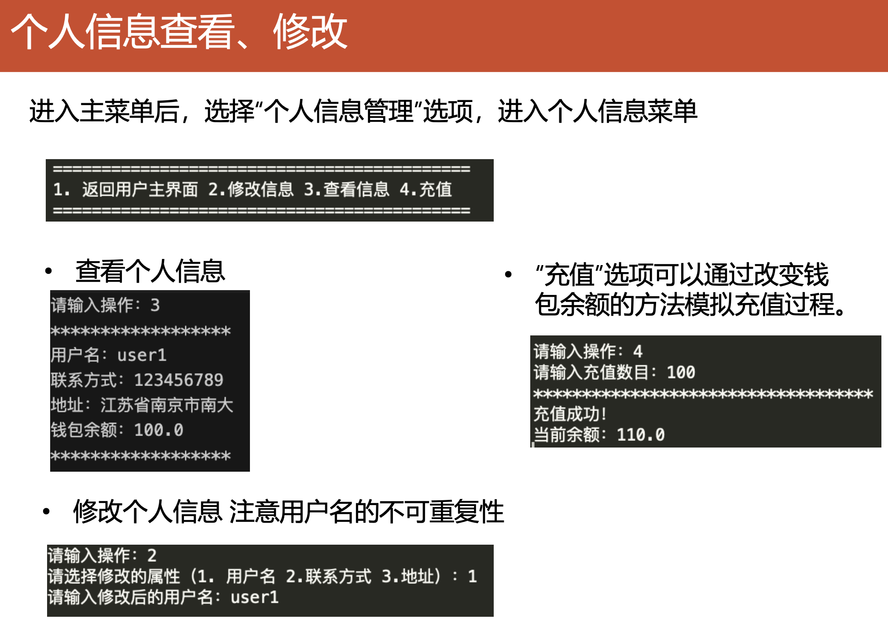

## 数据储存示例

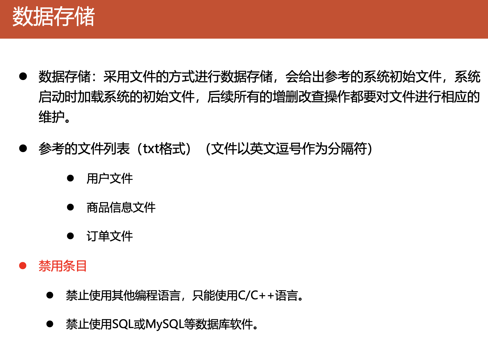

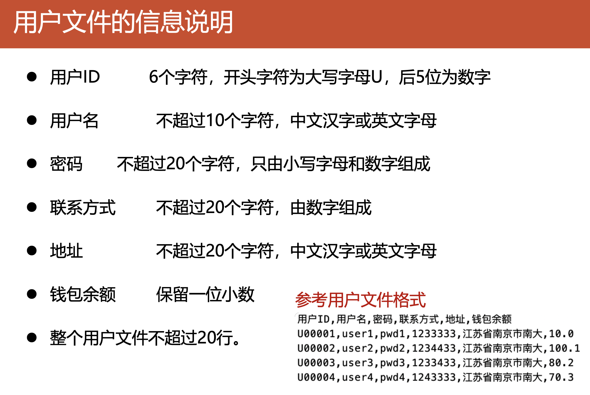

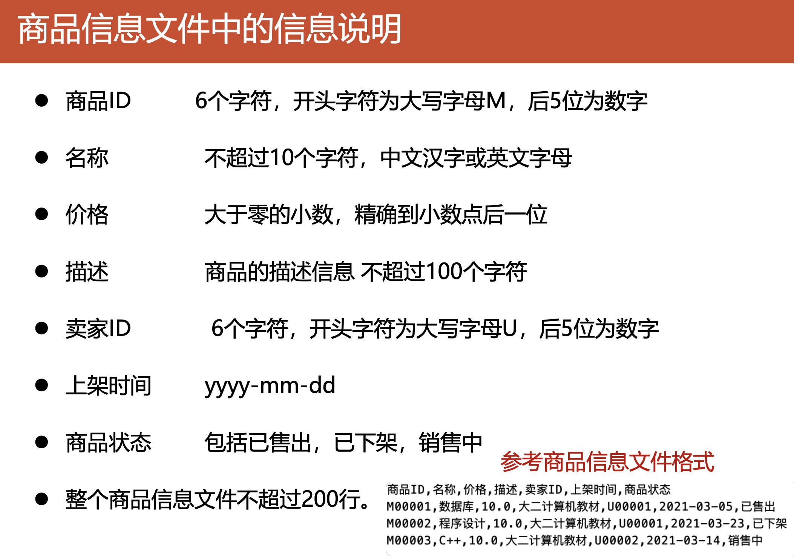

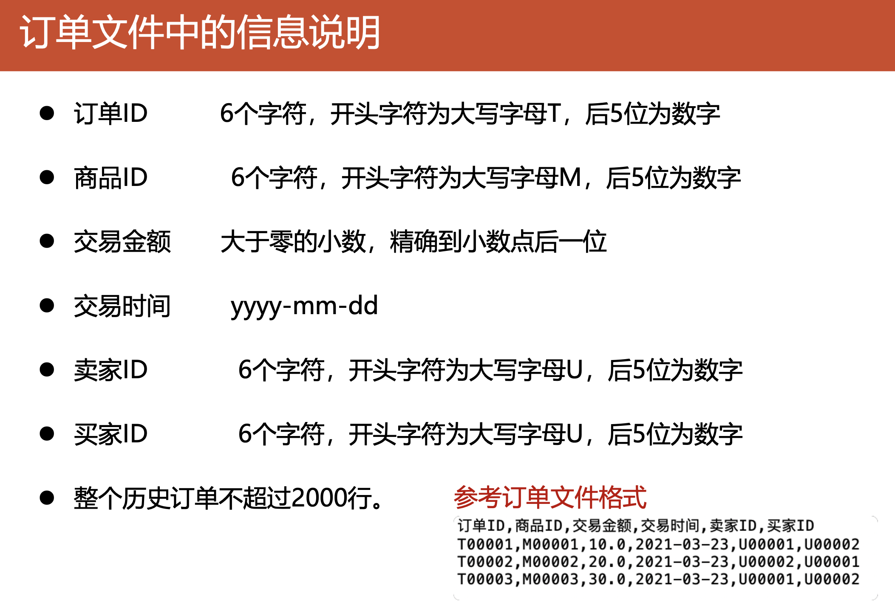

## 其他要求

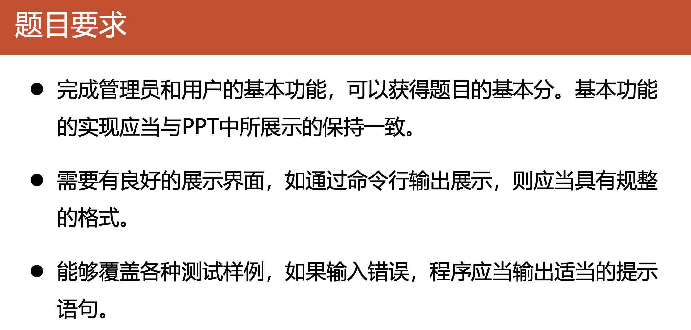


到此，你应当已经熟知了这个项目的基本需求。


