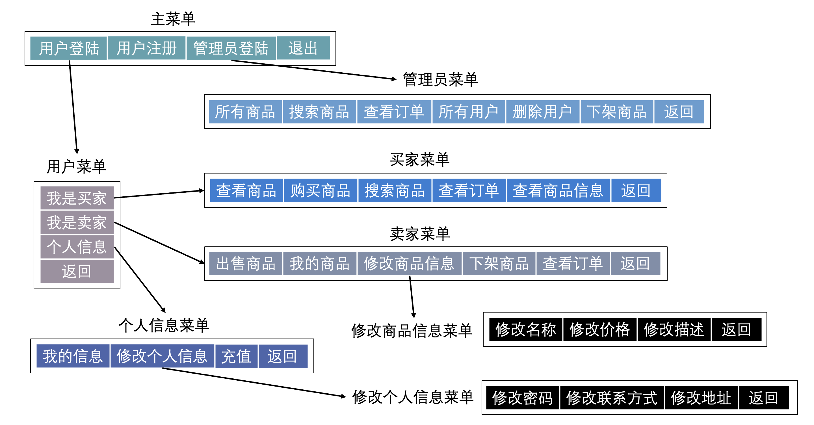

# 🖥 最后一座大山——界面

## 引子

我们已经做了许多添砖加瓦的工作，下面我们只需要把这些部分都组合起来就可以了。

不过，行百里者半九十，这一部分也是最花时间的一部分，因为这一部分需要一直保持一个整体的宏观把控，不能乱了阵脚。

交互界面适合菜单一一对应的：



不过在实际的开发过程中我们往往是先有顶层的架构，再添砖加瓦。因为我的教程是在读者已经有了一个自己版本的基础上写的，所以采用了自下而上的顺序，这样教程写起来会轻松一些。

根据上面的需求，我们需要实现8个交互界面，声明如下：

```c
// interface.h
#ifndef _INTERFACE_H_
#define _INTERFACE_H_

#include "tools/hint.h"
#include "menu/menu.h"
#include "user/user.h"
#include "good/good.h"
#include "order/order.h"

/* An interface gets user input with corresponding menu and handles it. */

/**
 * @brief 
 * | 1.User Login | 2.User Sign Up | 3.Admin Login | 4.Exit |
 */
void MAIN_Interface();

/**
 * @brief 
 * | 1.Goods | 2.Search | 3.Orders | 4.Users | 5.Delete | 6.Ban | 7.Back |
 */
void ADMIN_Interface();

/**
 * @brief 
 * | 1.Buyer | 2.Seller | 3.Information | 4.Back |
 */
void USER_Interface();

/**
 * @brief 
 * | 1.Goods | 2.Buy | 3.Search | 4.Order | 5.Infomation | 6.Back |
 */
void BUYER_Interface();

/**
 * @brief 
 * | 1.Sell | 2.Goods | 3.Modify | 4.Ban | 5.Order | 6.Back |
 */
void SELLER_Interface();

/**
 * @brief 
 * | 1.Information | 2.Modify | 3.Top Up | 4.Back |
 */
void INFO_Interface();

/**
 * @brief 
 * | 1.Password | 2.Contact | 3.Address | 4.Back |
 */
void MODIFY_Interface();

/**
 * @brief 
 * | 1.Name | 2.Price | 3.Description | 4.Back |
 */
void GOOD_Interface();

#endif
```

> 这个模块里面所有的8个`.c`文件都会包含这个头文件，因为交互界面需要喝我们之前写好的所有模块打交道，所以我们直接在头文件里面包含要用到的之前写好的所有模块。

## 当前进度

```c
.---+- include -+- tools -+- color.h
    |           |         +- hint.h
    |           |         +- info.h
    |           | 
    |           +- user  -+- user.h
    |           |
    |           +- good  -+- good.h
    |           |
    |           +- order -+- order.h
    |           |
    |           +- menu  -+- menu.h
    |           |
    |           +- interface -+- interface.h <---
    |           |
    |           +- config.h
    |
    +-   src   -+- tools -+- color.c
                |         +- hint.c
                |         +- info.c 
                |
                +- data  -+- id.txt
                |         +- user.txt
                |         +- good.txt 
                |         +- order.txt
                |
                +- user  -+- user.c 
                |
                +- good  -+- good.c
                |
                +- order -+- order.c
                |
                +- menu  -+- menu.c
                |
                +- interface -+- mainInterface.c <---
                |            -+- adminInterface.c <---
                |            -+- userInterface.c <---
                |            -+- infoInterface.c <---
                |            -+- modifyInterface.c <---
                |            -+- sellerInterface.c <---
                |            -+- goodInterface.c <---
                |            -+- buyerInterface.c <---
                |
                +- main.c
```

## 交互界面到底在做什么

交互界面主要做工作流程如下：

* 通过菜单获取用户输入
*   根据用户输入选择对应的处理函数

    > 这里的处理函数有可能是下一级交互界面。
* 重复上述步骤，直到用户选择退出这一级界面

根据上述内容，我们实现一个稚嫩的主菜单。

## 一个稚嫩的主菜单

```c
// mainInterface.c
#include "interface/interface.h"
#include "tools/hint.h"
#include "menu/menu.h"

static void USER_Login() { ... }
static void USER_SignUp() { ... }
static void ADMIN_Login() { ... }

void MAIN_Interface() {
    successMessage(); // 成功进入主菜单
    int op = menu(MAIN); // 使用菜单获取用户输入
    while (op != optionNum[MAIN]) {
    // 如果用户不选择退出（默认都是最后一个选项是退出）
        loadingMessage();
        if (op == 1) {
            USER_Login(); // 用户登陆
        }
        else if (op == 2) {
            USER_SignUp(); // 用户注册
        }
        else if (op == 3) {
            ADMIN_Login(); // 管理员登陆
        }
        op = menu(MAIN); 
    } 
    loadingMessage(); 
    successMessage();
}
```


这里用到了`optionNum`数组，这也是为什么在`menu.c`中`optionNum`并没有用`static`限制，同样也是为什么在menu.h中给了这个数组的声明。


其实按照上面的实现思路，一部分一部分慢慢写，已经可以完成这个项目的全部功能了。但这毕竟是个教学性质的项目，我希望自己的代码稍微漂亮一点。

> 言下之意就是实际写代码的时候能跑就行，也不管多丑陋或者多难扩展，哈哈。

上面的代码有如下一些可以优化的地方：

* 一大坨`if-else`
* 马上至少要写8遍几乎重复的代码

> 有没有发现和我们之前写menu的时候遇到的丑陋一摸一样，不过这次的处理方式不一样了。

## 优化实现方式

### 优化1：处理丑陋的`if-else`

这里，我们采用的方式和之前`menu`的方式一样——哈希表（其实就是打表格，建立映射关系）。

但之前我们是把字符串放在数组里面的，现在我们需要建立的是整数和函数之间的关系，函数可以放在数组里面吗？

其实是可以的，我使用了函数指针，首先在`interface.h`中，我们定义一个处理器类型：

```c
// interface.h
typedef void (*HANDLER)(void);
```


这里需要了解函数指针的知识点，一般在程序设计基础课程的最后几节课讲，并且很快划过，所以作为C-Beginner最好能够找一个教程回顾一下。

参考教程：[https://www.runoob.com/cprogramming/c-fun-pointer-callback.html](https://www.runoob.com/cprogramming/c-fun-pointer-callback.html)

> 上述教程里面还提到了回调函数的用法，如果你学过SICP，可以和HOF(Higher Order Function)做一下比较。

之后的内容里，笔者会默认各位小可爱已经知晓了函数指针的概念和用法，加油哈。


所以我们可以定义这样一个数组：

```c
// mainInterface.c
#include "interface/interface.h"

static HANDLER handler[] = {USER_Login, USER_SignUp, ADMIN_Login};
```

于是我们的`MAIN_Interface`可以这样实现：

```c
void MAIN_Interface() {
    successMessage();
    int op = menu(MAIN);
    while (op != optionNum[MAIN]) {
        loadingMessage();
        handler[op - 1]();
        op = menu(MAIN); 
    }
    loadingMessage();
    successMessage();
}
```

这样是不是简洁多啦。不过哪怕是这个简洁的代码，反复写8遍也够呛，所以我们下面作进一步优化。

### 优化2：处理重复书写的效率

这里我采用的方法是通过带参数的宏，优化相似代码重复书写的问题。

```c
// interface.h

// 一个棒棒的宏
#define make_interface(T, YPE)\
void T##YPE##_Interface() {\
    successMessage();\
    int op = menu(T##YPE);\
    while (op != optionNum[T##YPE]) {\
        loadingMessage();\
        handler[op - 1]();\
        op = menu(T##YPE);\
    }\
    loadingMessage();\
    successMessage();\
}
```

> 这里把`TYPE`分下来写是因为不和枚举类型`Menu`中枚举量的标识符冲突。


这里需要读者理解C语言的宏定义，简单理解就是直接替换。不过最好找一个教程看一下。

参考教程： [https://blog.csdn.net/yanggangclcsdn/article/details/49704089](https://blog.csdn.net/yanggangclcsdn/article/details/49704089)

后面我就默认读者知道宏定义的用法啦。


当我在`interface.h`中定义了上面的宏之后，我们`mainInterface.c`就可以这样写了：

```c
// mainInterface.c
#include "interface/interface.h"

static void USER_Login() { ... }
static void USER_SignUp() { ... }
static void ADMIN_Login() { ... }

static HANDLER handler[] = {USER_Login, USER_SignUp, ADMIN_Login};

make_interface(M, AIN)
```

是不是整个文件都简洁起来了？


这里的处理手法最好能够驻足看一下。

学过SICP的小可爱应该对Higher Order Function还有印象，C语言虽然不支持Higher Order Function，但是我们可以通过很多方法实现Higher Order Function那样的效果。

比如说之前的函数指针，实现了类似函数作为参数的功能；

这里的make\_interface宏，实现了类似函数作为返回值的功能。

而高阶函数的定义：

> A higher order function is a function that either takes in a function as an argument or returns a function.

我们实现了这两种效果不就相当于有了高阶函数的功能了吗？是不是感觉不管多接近底层的语言会用总是可以很强大的。:smile:

其实，像Python这样貌似很方便的语言，它的解释器其实也是C语言写的。

那C语言呢？

那C语言呢？

那C语言呢？

我不展开说，只举一个简单的例子。

我们使用的`printf`也是一个函数，但是这个函数的定义是什么呢？`stdio.h`头文件中装的只不过是函数的声明（所有的头文件都只能放函数的声明，放定义的话被多次包含会出现函数重定义的错误），那函数的定义到底在哪儿呢？

其实`printf`函数的定义不是用C语言写的，它本质上其实是用二进制（0和1）写的。我们享受了高级编程语言的红利，但总有一些底层的砖块不得不用二进制来写，然后在这些0和1组成的砖块上搭建起宏伟的大厦。


## 先搭骨架再填血肉

在`mainInterface.c`中定义一个`inv`函数：

```c
// mainInterface.c
#include "interface/interface.h"

void inv() { 
    invalidMessage(); 
    failureMessage();
}
```

然后将这个函数的声明放在`interface.h`中，因为所有的`interface`模块的源文件都包含了`interface.h`，所以这些模块都可以使用这个`inv`函数。

```c
// interface.h
void inv();
```

在我们搭建骨架的时候，为了使得程序能够正常跑起来，方便调试，我们将还未实现的部分，用上面的无效处理器（这里的处理器就是之前定义的`Handler`类型）代替。

#### 主交互界面

于是`mainInterface.c`可以这样写（把之前用省略号蒙混过关的处理器都换成`inv`）：

```c
// mainInterface.c
#include "interface/interface.h"

void inv() { 
    invalidMessage(); 
    failureMessage();
}

static HANDLER handler[] = {inv, inv, inv};
make_interface(M, AIN)
```

是不是非常简洁，之后我们只需要用模块内的`static`方法来代替这些`inv`就可以实现我们所需要的功能了。这部分先按下不表，我们先把整体的框架全部搭好。除了直接切换交互界面以外的命令全部用`inv`代替。准备好接受特别舒服简洁的框架搭建过程了吗？

### 继续冲鸭！

#### 管理员交互界面框架

```c
#include "interface/interface.h"

static HANDLER handler[] = {inv, inv, inv, inv, inv, inv};
make_interface(A, DMIN)
```

#### 用户交互界面框架

```c
// userInterface.c
#include "interface/interface.h"

static HANDLER handler[] = {BUYER_Interface, SELLER_Interface, INFO_Interface};
make_interface(U, SER)
```


有没有发现我们只用了3行就写完了用户交互界面？是不是特别爽？

一定要好好理解此处的代码设计哦。


#### 用户信息交互界面框架

```c
// infoInterface.c
#include "interface/interface.h"

static HANDLER handler[] = {inv, MODIFY_Interface, inv};
make_interface(I, NFO)
```

#### 修改用户信息交互界面框架

```c
// modifyInterface.c
#include "interface/interface.h"

static HANDLER handler[] = {inv, inv, i};nv
make_interface(M, ODIFY)
```

#### 卖家交互界面框架

```c
// sellerInterface.c
#include "interface/interface.h"

static HANDLER handler[] = {inv, inv, GOOD_Interface, inv, inv};
make_interface(S, ELLER)
```

#### 修改商品信息交互界面框架

```c
// goodInterface.c
#include "interface/interface.h"

static HANDLER handler[] = {inv, inv, inv};
make_interface(G, OOD)
```

#### 买家交互界面框架

```c
#include "interface/interface.h"

static HANDLER handler[] = {inv, inv, inv, inv, inv};
make_interface(B, UYER)
```

在之后的实现过程中，也会充分利用带参数的宏来帮助我们简化代码，可以注意一下哈。

当然，这些带参数的帮助宏有的可以在好几个交互界面里面复用，所以我们将把这些帮助宏放在`interface.h`头文件里面。


到此，我们搭建完了所有的交互界面框架，下面我们只需要把这些`inv`都替换成我们的实现就行了。

